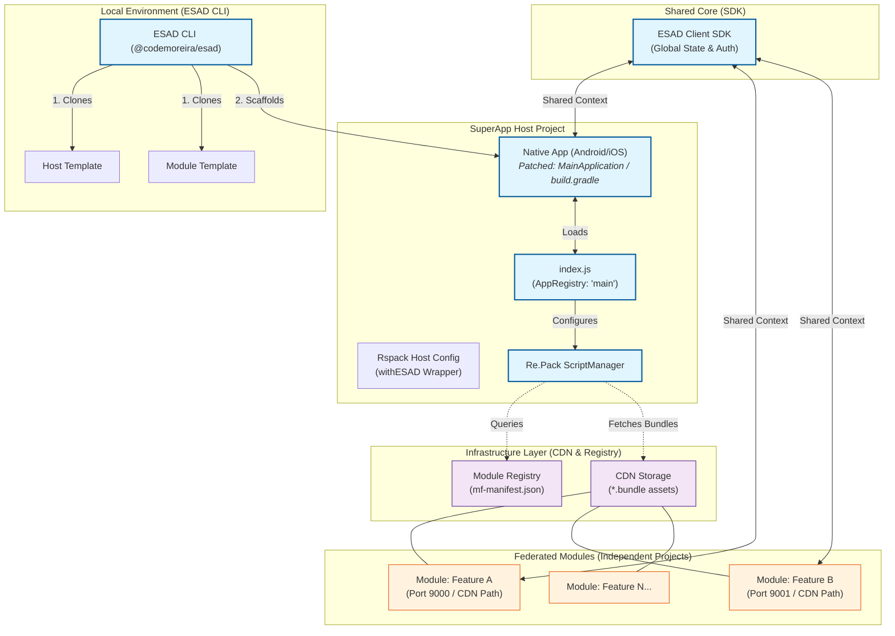
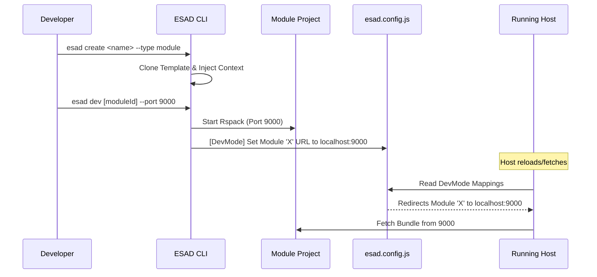
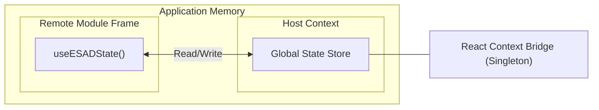

# ESAD: Complete Architecture & Lifecycle Diagrams

This guide details the technical architecture and the full development/deployment lifecycle of a SuperApp built with the **ESAD** framework.

---

## 🏗️ 1. Detailed System Architecture
This diagram illustrates the separation of concerns and the plumbing between the Host, multiple Federated Modules, the ESAD environment, and the distribution layer.

---

## 🚀 2. End-to-End Workflow (Development to Deploy)
A step-by-step sequential view of creating, developing, and deploying modules in the ESAD ecosystem.

### A. Host & Workspace Setup
1. **`esad init <name>`**: Clones the host template, renames project identifiers, and installs base dependencies.
2. **`esad host dev`**: 
   - Verifies `android/ios` folders.
   - Runs `expo prebuild` (if needed).
   - **Automated Patch**: Injects Re.Pack configs into Gradle/Native entry points.
   - Starts Rspack Server (8081).
   - Launches Mobile Emulator.

### B. Module Development Cycle

### C. Deployment Flow
1. **`esad build`**: Performs the production build for the specific module/platform.
2. **Bundle Generation**: Rspack generates the `.container.js.bundle` and chunks into the `./build` directory.
3. **`esad deploy`**: Packages the `./build` folder and performs the real multipart upload to the CDN.
4. **Registry Update**: The CDN Registry updates its versioning and the `mf-manifest.json`.
5. **Instant Update**: The Host App receives the new version on the next launch (OTA) or module resolution.

---

## 🔥 3. Comparison: Vanilla Re.Pack vs ESAD
*Why is ESAD needed for presentations?*

| Feature | Vanilla Re.Pack | ESAD Framework |
| :--- | :--- | :--- |
| **Setup** | Manual (Hours/Days) | Command-line (Minutes) |
| **Native Patching** | Manual (Error-prone) | Automated (CLI-driven) |
| **Expo Integration** | Complex (Metro conflicts) | Transparent (Zero-Config Redirection) |
| **Shared State** | Peer-dependency hell | Built-in SDK Wrapper |
| **Scaffolding** | Manual Boilerplate | GitHub Template Cloning |
| **Registry Management** | Custom Implementation | Integrated CDN/MF-Manifest logic |

---

## 🏛️ 4. Global State Bridge
Diagram showing how the SDK bridges the Host and the Remote Modules.

> [!TIP]
> This "Singleton Bridge" is the core reason why federated modules feel native and integrated, rather than isolated webviews or separate apps.
