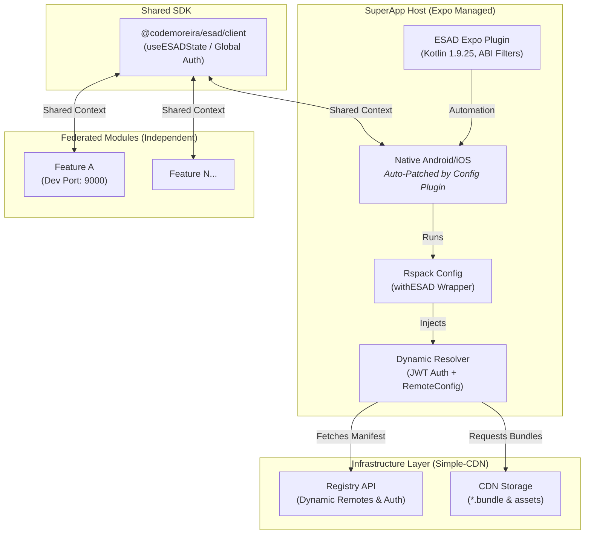

# ESAD: Architecture & Zero-Config Lifecycle (v2.0)

This document defines the high-level architecture and the automated development lifecycle of the **ESAD** ecosystem, powered by **Expo SDK 52**, **Re.Pack 5.2.5**, and **Rspack**.

---

## 🏗️ 1. System Architecture: The "Zero-Config" Foundation

ESAD moves away from manual native patching toward a **Plugin-Driven Architecture**. The native environment is ephemeral (generated via Expo Prebuild) and automatically optimized for Module Federation.

```mermaid
graph TB
    subgraph "Infrastructure Layer (Simple-CDN)"
        REG["Registry API<br/>(Dynamic Remotes & Auth)"]
        CDN["CDN Storage<br/>(*.bundle & assets)"]
    end

    subgraph "SuperApp Host (Expo Managed)"
        H_Native["Native Android/iOS<br/><i>Auto-Patched by Config Plugin</i>"]
        H_Plugin["ESAD Expo Plugin<br/>(Kotlin 1.9.25, ABI Filters)"]
        H_Rspack["Rspack Config<br/>(withESAD Wrapper)"]
        H_Resolver["Dynamic Resolver<br/>(JWT Auth + RemoteConfig)"]
    end

    subgraph "Federated Modules (Independent)"
        Mod_1["Feature A<br/>(Dev Port: 9000)"]
        Mod_N["Feature N..."]
    end

    subgraph "Shared SDK"
        SDK["@codemoreira/esad/client<br/>(useESADState / Global Auth)"]
    end

    %% Flows
    H_Native -->|Runs| H_Rspack
    H_Rspack -->|Injects| H_Resolver
    H_Resolver -->|Fetches Manifest| REG
    H_Resolver -->|Requests Bundles| CDN
    
    %% Communication
    SDK <-->|Shared Context| H_Native
    SDK <-->|Shared Context| Mod_1
    SDK <-->|Shared Context| Mod_N
    
    %% Scaffolding
    H_Plugin -->|Automation| H_Native
```

---

## 🚀 2. The Development Lifecycle

ESAD automates the complex "plumbing" of React Native Module Federation.

### A. Initialization & Scaffolding
- **`esad init <name>`**: Clones the state-of-the-art Host template.
- **Auto-Registration**: The CLI automatically injects `@codemoreira/esad/expo-plugin` into the `app.json`.
- **Zero-Config Exposes**: Modules automatically expose their main entry point as `./Main` without requiring manual Rspack edits.

### B. The "dev" Flow (The Maestro)
When you run `esad dev`, the following sequence occurs:
1. **Native Check**: Verifies if `android/` or `ios/` folders exist.
2. **Auto-Prebuild**: If missing, runs `npx expo prebuild` to generate clean native code.
3. **Script Fixer**: Automatically reverts `package.json` scripts from Expo defaults to `esad dev --platform`.
4. **Bundler Check**: Detects if an Rspack server is already running on port 8081/9000.
5. **Native Launch**: Launches the app using the standard React Native CLI (avoiding Metro conflicts).

---

## 🛡️ 3. Security & Dynamic Resolution

Unlike standard Module Federation (which uses static URLs), ESAD implements a **Authenticated Dynamic Resolver**.

1. **Login**: The user authenticates against the Simple-CDN Registry.
2. **Remote Mapping**: The Registry returns a map of authorized modules for that specific user.
3. **JWT Injection**: Every bundle request (`.bundle`) is intercepted by the Re.Pack `ScriptManager`, which injects the Bearer Token into the headers.
4. **Resilience**: If a remote fails to load, the `SafeRemote` Error Boundary prevents the entire SuperApp from crashing.

---

## ⚖️ 4. Comparison: Vanilla vs ESAD v2.0

| Feature | Vanilla Re.Pack / Expo | ESAD Ecosystem |
| :--- | :--- | :--- |
| **Kotlin Version** | 1.8.x (Default) | 1.9.25 (Automated) |
| **ABI Filtering** | Manual Gradle edits | Automatic (Config Plugin) |
| **Module Exposes** | Manual Map in Config | Auto-detected (Zero-Config) |
| **Authentication** | Custom implementation | Native JWT + Header Injection |
| **Scripts** | Fragile `expo run` | Robust `esad dev` wrapper |
| **Native Folders** | Version controlled | Git-ignored (Ephemeral/Prebuild) |

---

## 🏛️ 5. Shared State (The Bridge)
The `useESADState` hook creates a memory bridge between the Host and Remotes.

- **Host**: Defines the "Source of Truth" (e.g., `auth_user`).
- **Remote**: Consumes or updates the state as if it were a local `useState`.
- **Sync**: Powered by a Singleton React Context that is shared across the federated boundaries.

---

> [!IMPORTANT]
> **Zero-Config Philosophy**: The developer should focus on business logic. All native infrastructure, ABI filters, and bundler complexity are handled by the ESAD toolset.
